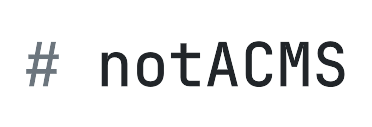

<picture>
  <source media="(prefers-color-scheme: dark)" srcset="docs/logo/logo-white.png">
  <source media="(prefers-color-scheme: light)" srcset="docs/logo/logo-dark.png">
  
</picture>


## Symfony-based, AI-friendly static site generator — Markdown content, multi-language, zero-database

**Live demo: [notacms.holas.pl](https://notacms.holas.pl)**

notACMS is a static site generator built on Symfony 7.4. Write content in Markdown with YAML frontmatter, configure your locales and site settings in a single YAML file, and deploy a fully pre-rendered HTML site served by nginx — no database, no runtime PHP (except an optional contact form). Customize templates, styles, and content without touching core files via the `local/` override system.

## What is notACMS?

- **Static by default** — all pages are pre-rendered to HTML at build time; nginx serves them directly
- **Multi-language** — any number of locales, configured in `local/content/_site.yaml`; the demo ships with English, German, and Polish
- **Markdown content** — posts and pages are Markdown files with YAML frontmatter; no admin panel, no database
- **`local/` overrides** — templates, SCSS, translations, nginx config, and content all live in `local/` so you never modify core files
- **Two themes out of the box** — ship the minimal **bare** wireframe for custom builds, or the polished **demo** (amber-phosphor with dark mode, search overlay, docs sidebar) shown on the live site above

> Upgrading from 1.0.0? See [UPGRADE-1.1.md](UPGRADE-1.1.md). The drop-in `old-template` compatibility package shipped through v1.1.x — copy it from a v1.1.x tag if needed.

## Quickstart

Requires [DDEV](https://ddev.readthedocs.io/) and Node.js/npx (for Pagefind search index).

```bash
git clone https://github.com/holas1337/notACMS my-site
cd my-site
ddev start
ddev build          # seeds local/ from docs/demo/ (default) and builds the site
# or
ddev build --bare   # seed from docs/bare/ — minimal wireframe, build your own look on top
```

Open `https://notacms.ddev.site` to see your site. Edit `local/content/_site.yaml` to configure your domain, locales, and site name.

**Theme choice on first build**:

- `--demo` (default) — copies the full demo design into `local/`: templates, SCSS, JS, translations, nginx, content. Matches the live site at notacms.holas.pl.
- `--bare` — copies only minimal seed content into `local/content/`. Core bare templates and styles render the site. Use this when you plan to write your own theme.

Flags are mutually exclusive. Once `local/` has content, subsequent `ddev build` runs skip seeding.

## Key Commands

### DDEV — Development

| Command | Description |
|---|---|
| `ddev start` | Start DDEV development environment |
| `ddev build` | Full production build (static HTML + search index) |
| `ddev test` | Run PHPUnit test suite |
| `ddev code-check` | Run code quality checks (CS Fixer, Rector, PHPStan, Twig lint) |
| `ddev code-fix` | Auto-fix PHP code style issues |
| `ddev exec php bin/console sass:build --watch` | SCSS watch mode |

### `./notACMS` — Production / development without DDEV

| Command | Description |
|---|---|
| `./notACMS deploy --prod` | Production deploy: build image, start containers, full build (seeds `local/` only if empty) |
| `./notACMS deploy --prod --bare` | Production deploy with bare wireframe theme |
| `./notACMS deploy --prod --port 8081` | Override port at runtime |
| `./notACMS deploy down` | Stop and remove containers |
| `./notACMS rebuild` | Rebuild static HTML + search index (containers already running) |
| `./notACMS rebuild --bare` | Rebuild and re-seed `local/content/` from `docs/bare/` |
| `./notACMS --help` | Show all commands and options |

Set `NGINX_PORT=80` in `.env.local` to expose on port 80.

## Tech Stack

- **PHP 8.5** + **Symfony 7.4** (minimal, no database)
- **DDEV** for local development
- **Markdown** content with YAML frontmatter
- **Twig** templates
- **Pagefind** for client-side search (WASM, auto language split)
- **Cloudflare Turnstile** captcha on contact form
- **AssetMapper** for frontend assets (no Node.js build step)

## Documentation

| File | Contents |
|---|---|
| [docs/ARCHITECTURE.md](docs/ARCHITECTURE.md) | Content pipeline, routing, services, and templates |
| [docs/EDITOR_GUIDE.md](docs/EDITOR_GUIDE.md) | How to write and publish posts and pages (frontmatter, images, drafts, series) |
| [docs/STYLEGUIDE.md](docs/STYLEGUIDE.md) | Design tokens, components, and the living styleguide |
| [docs/LOCALES.md](docs/LOCALES.md) | How to add, remove, or manage locales |
| [docs/CUSTOMIZATION.md](docs/CUSTOMIZATION.md) | How to override templates, JS, SCSS, and nginx config via `local/` |
| [docs/THEME_BUILDING.md](docs/THEME_BUILDING.md) | Theme API reference — template contexts, Twig functions & globals, ContentItem API, required translation keys |
| [docs/TESTING.md](docs/TESTING.md) | How to run tests, write new tests, and the coverage strategy |
| [docs/TESTS.md](docs/TESTS.md) | Quick reference: test file map, fixtures, naming conventions |

## AI / MCP Servers

notACMS is designed to be AI-friendly — content is Markdown with structured YAML frontmatter, all configuration lives in plain text files, and the `local/` override system means an AI agent can customize the site without touching core files.

Two optional MCP servers are used for AI-assisted content workflows (image generation).

### Draw Things (local image generation)

Requires [Draw Things](https://drawthings.ai/) running locally with the API server enabled (Settings → API Server).

**Claude Code:**
```bash
claude mcp add draw-things \
  --env DRAWTHINGS_HOST=YOUR_DRAW_THINGS_IP \
  --env DRAWTHINGS_PORT=7860 \
  -- npx -y mcp-drawthings
```

**OpenCode** — add to `~/.opencode/opencode.json`:
```json
{
  "$schema": "https://opencode.ai/config.json",
  "mcp": {
    "draw-things": {
      "type": "local",
      "command": ["npx", "-y", "mcp-drawthings"],
      "environment": {
        "DRAWTHINGS_HOST": "YOUR_DRAW_THINGS_IP",
        "DRAWTHINGS_PORT": "7860"
      },
      "timeout": 600000,
      "enabled": true
    }
  }
}
```

**Important:** Klein 9B image generation takes time — `timeout: 600000` (600 seconds) is required. Also, **always pass all parameters explicitly** (`model`, `width`, `height`, `steps`, `seed`, `cfg_scale`) when calling the MCP tool, even if they match current Draw Things settings.

See `local/docs/EDITOR_GUIDE.md` → "AI image generation" for model settings and batch workflow.

### Hugging Face (cloud image generation fallback)

**Claude Code:**
```bash
claude mcp add --transport http hf-mcp-server https://huggingface.co/mcp \
  --header "Authorization: Bearer YOUR_HF_TOKEN"
```

**OpenCode** — add to `~/.opencode/opencode.json`:
```json
{
  "hf-mcp-server": {
    "type": "remote",
    "url": "https://huggingface.co/mcp",
    "headers": {
      "Authorization": "Bearer YOUR_HF_TOKEN"
    },
    "enabled": true
  }
}
```

Get your token at [huggingface.co/settings/tokens](https://huggingface.co/settings/tokens). Used as a fallback when Draw Things is unavailable.

## License

Apache 2.0 — see [LICENSE](LICENSE).

## Third-Party Licenses

This project uses open-source software. All dependency licenses are available
in `vendor/*/LICENSE` after running `composer install`.

## Contributing

See [CONTRIBUTING.md](CONTRIBUTING.md) for development setup, code standards, and the PR process. For site customizations, use the `local/` override system — no core files need editing. See [docs/CUSTOMIZATION.md](docs/CUSTOMIZATION.md).

## Contact

Built by a developer, for developers — [holas](https://holas.pl)
